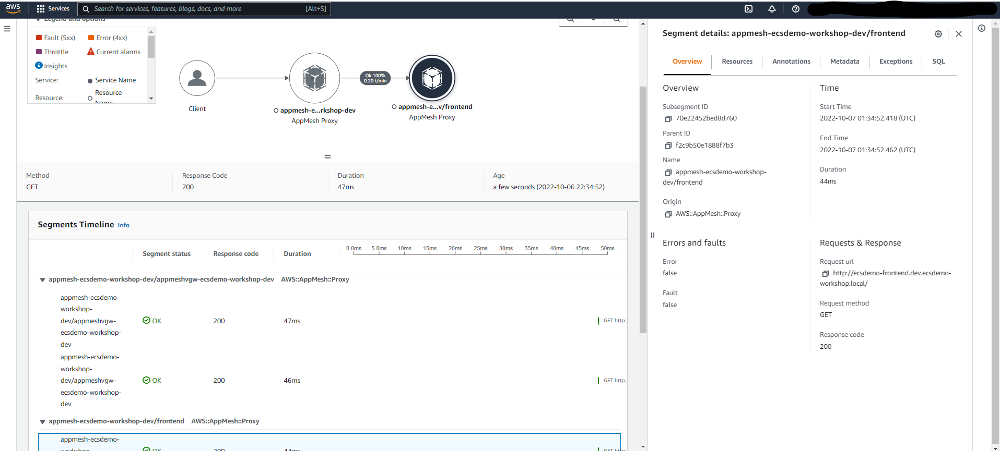

# AWS AppMesh with Copilot - Sample

## Overview

This repo intends to demonstrate how to deploy a simple application on ECS Fargate integrated with [AWS App Mesh](https://aws.amazon.com/pt/app-mesh/) using [AWS Copilot CLI](https://aws.github.io/copilot-cli/). The main goal is provide a sample on how easy is deploying an application with a service mesh on AWS.
*** 


## Prerequisites:
- [awscli](https://docs.aws.amazon.com/cli/latest/userguide/cli-chap-install.html)
- [Pre configured AWS credentials](https://docs.aws.amazon.com/amazonswf/latest/developerguide/RubyFlowOptions.html)
- [Docker](https://docs.docker.com/get-docker/)
- [Git](https://github.com/git-guides/install-git)
- [AWS Copilot CLI](https://aws.github.io/copilot-cli/docs/getting-started/install/)


## 1. Initializing

### 1.1. Initializing the Application

```sh
cd appmeshcopilot
git clone https://github.com/aws-containers/ecsdemo-nodejs.git
git clone https://github.com/aws-containers/ecsdemo-crystal.git
git clone https://github.com/aws-containers/ecsdemo-frontend.git
rm -rf ecsdemo-frontend/copilot
export appName=ecsdemo-workshop
export envName=dev
```

```sh
copilot app init $appName
```

In a clean configuration, Copilot will create the copilot folder and the .workspace file automatically. For this example, the copilot folder is already pre-created with the necessary files and customizations for deployment with AWS AppMesh and AWS X-Ray. 
The “copilot app init” command will generate a CloudFormation stack to prepare the functions so that CloudFormation can create application resources (such as S3, ECR, SNS, etc.)


### 1.2 Initializing the Environment

In this demo the manifest of the application is already created by copilot, so we can move forward and create the environment with:

```sh
copilot env init --name $envName
```

This command will ask for the credential configured in the AWS CLI (in this example we use the default configured in the AWS CLI setup), the environment configuration (default or imported) and will create a manifest file for that environment. It will also use CloudFormation to create Roles an S3 bucket to store required artifacts.
1. What is your credential? Default
2. Would you like to use default configuration for a new environment? Yes, use default (or you can configure the resources or even import existing ones)
    - A new VPC with 2 AZs, 2 public subnets and 2 private subnets
    - A new ECS Cluster
    - New IAM Roles to manage services and jobs in your environment

Now we can deploy the environment in order to create the base environment (VPC, Subnet, IGW, Roles, ECS Cluster). Use the command:

```sh
copilot env deploy --name $envName
```

We're now ready to deploy the application components and gateway.

## 2. Deploying Services


### 2.1 Deploying AppMesh Gateway

Let's start deploying the AppMesh Gateway. It will be the entry point for your Application Service Mesh.
All external communication (from outside of the Mesh) needs to be sent through a Network Load Balancer to the Envoy Gateway running on ECS Fargate.

```sh
cd appmesh-gateway
copilot init -n ecsdemo-envoygw -t "Load Balanced Web Service"
```
Select the "./Dockerfile" option.

AWS Copilot will ask the following question: “Would you like to deploy a test environment?” , since we have already created an environment (infrastructure resources) for the application in our scenario we are not going to create a test environment, answering "N". Then run the service deploy command:

```sh
copilot svc deploy --name ecsdemo-envoygw --env $envName
```

Take note of the Network Load Balancer public address. It will be used to test your application.

The resources that copilot will create is related to Service Type that you choose. For gateway service we select Load Balanced Web Service, and then we customized the manifest.yml to create an NLB instead of a default ALB (you can check the manifest file at copilot/ecsdemo-envoygw folder). 
The parameters that can be used like healthchecks, how to pass variables to ECS tasks, etc. can be checked at CopilotDocs[https://aws.github.io/copilot-cli/docs/manifest/overview/].

Now we have the infrastructure and the gateway ready. Ket's deploy the other layers (services) of the application together with the AppMesh components (sidecars, Virtual Nodes and Virtual Services).

### 2.2. Deploying ECS-Crystal Service

The Appmesh requires 2 things on each task/container that belongs to a mesh:
1. A IAM Role that has permission to appmesh:StreamAggregatedResources, so that the Task could send informations to AppMesh service.
2. A envoy sidecar attached to the container with a Variable containing the ARN of a Virtual Node created on App Mesh.
Both components will be added thorugh the [Copilot Addons(Cloudformation template files at Addons folder)](https://aws.github.io/copilot-cli/docs/developing/addons/modeling/).

Let's deploy our application services with required AppMesh configurations (Virtual Nodes):

```sh
cd ../ecsdemo-crystal
copilot init -n ecsdemo-crystal -t "Backend Service"
```

Select the "./Dockerfile" option and again, answer “N” to the question: “Would you like to deploy a test environment?”. Then:

```sh
copilot svc deploy --name ecsdemo-crystal --env $envName
```

### 2.2. Deploying ECS-NodeJs Service

We will perform the same process as in the previous step, creating a new service in ECS Fargate and automatically a new Virtual Node and Virtual Service in the App Mesh (you can check how to create the AppMesh components for each service in the copilot/addons folder).

```sh
cd ../ecsdemo-nodejs
copilot init -n ecsdemo-nodejs -t "Backend Service"
```
Select the "./Dockerfile" option and again, answer “N” to the question: “Would you like to deploy a test environment?”. Then:

```sh
copilot svc deploy --name ecsdemo-nodejs --env $envName
```
This step can take several minutes, because Copilot will build the image using Docker, push the image to ECR, deploy and test the service reachability on ECS Fargate. 

### 2.2. Deploying ECS-FrontEnd Service

We will perform the same process as in the previous step, creating a new service in ECS Fargate and automatically a new Virtual Node and Virtual Service in the App Mesh (you can check how to create the AppMesh components for each service in the copilot/addons folder).
It is worth mentioning that although this service is our Frontend, we are creating it as a Backend, since all external traffic via Load Balancer will be received first by the AppMesh Gateway and only then will it be redirected to the frontend.

```sh
cd ../ecsdemo-frontend
copilot init -n ecsdemo-frontend -t "Backend Service"
```
Select the "./Dockerfile" option and again, answer “N” to the question: “Would you like to deploy a test environment?”. Then:

```sh
copilot svc deploy --name ecsdemo-frontend --env $envName
```

This step can take several minutes, because Copilot will build the image using Docker, push the image to ECR, deploy and test the service reachability on ECS Fargate. 
Even, if you get some failure events related to container health checks, just wait for completion.

## 3. Test your application

### 3.1 Access Network Load Balancer address

Check your application, pointing to the Network Load Balancer URL.
In case you missed, you can check you Network Load Balancer address with ```copilot svc show --name ecsdemo-envoygw``` and look for url, or in case you have jq installed use ```copilot svc show --name ecsdemo-envoygw --json | jq .routes[].url```

Using browser Dev Tool, at Network tab you can check that the Response Header contains "server:envoy". It means that your external request has been proxied by Envoy (AppMesh) and now you can control your routes and rules for each service.

### 3.2 Access AWS App Mesh console

Check the Virtual Nodes, which represent each of our resources/endpoints (ECS services, EKS deployments, or Amazon EC2 instances), hostnames, and listeners.


Verify that the Virtual Node frontend has 2 backend services (Crystal and nodejs). Since our frontend sends outbound traffic to these two elements, we say that the Virtual Node frontend has 2 backend services (note that the reference is to services and not to nodes).


Check the Virtual Services. Virtual services represent an abstraction of every real service represented by a Virtual Node or a Virtual Router (more details below) that we have in our mesh/application. When one service depends on another, they use the name of the Virtual Service for communication and this traffic is sent to the Virtual Node or Virtual Router that is providing that application service.


Check the Virtual Gateway. The Virtual Gateway is used to allow communication from outside to inside the mesh, such as user access or resource that is not part of the mesh. In our scenario, we created a Network Load Balancer to receive external clients and then send them to the Virtual Gateway (mesh gateway), which in turn has a single route sending to the frontend-router.


Check the Virtual Router and its routes. The Virtual Router is used to manage routes to different Virtual Nodes, specifying paths, weights, timeouts, retries, among others. For example, in our scenario we can use the Virtual Router (instead of sending traffic directly to a Virtual Node) to redirect different versions of our frontend, each version being a Virtual Node. This feature is especially useful when implementing canary or blue/green deployment strategies for certain application services.


## 4. Observability with X-Ray

Open the Amazon CloudWatch service using the AWS Management Console and in the X-Ray traces section on the left-hand side menu, select “Service map”. Explore our app map, response time by service, metrics, and tracking for each level.


In the X-Ray service map it is possible to graphically verify the communication map between services, the average time in each component, and the number of calls per minute


In the left menu, still in the “X-Ray traces” section, select “Traces”. In this way, it is possible to see a list view of each of the application calls and the total elapsed time (from the entry to the exit of a request). An example would be to view the path and response time that a user received when interacting with the application.


By clicking on an ID from the trace list, it is possible to detail each of the internal calls for that specific client/access, showing the entire path taken by the application. This visualization can be used primarily in troubleshooting scenarios in order to identify errors that affect specific groups of users.




## 5. OPTIONAL - Deploy Frontendv2 service 

Deploy version 2 of the frontend to show AppMesh balancing traffic between application version.

Copy ecsdemo-frontend folder to ecsdemo-frontendv2 folder and make some changes at home page using:

```sh
cd ..
cp -r ecsdemo-frontend ecsdemo-frontendv2
sed -i 's/#666666/#FFFFFF/' ecsdemo-frontendv2/app/views/application/index.html.erb
```
Note: if you're using MacOS, use "brew install gnu-sed" and then "gsed -i 's/666666/#FFFFFF/' ecsdemo-frontendv2/app/views/application/index.html.erb".


Then, you can deploy a new version of the frontend service (in our example we will see AppMesh routing traffic between to application versions).

```sh
cd ecsdemo-frontendv2
copilot init -n ecsdemo-frontendv2 -t "Backend Service"
```
Select the "./Dockerfile" option and again, answer “N” to the question: “Would you like to deploy a test environment?”. Then:

```sh
copilot svc deploy --name ecsdemo-frontendv2 --env $envName
```

Check your Network Load Balancer address and see the App Mesh Ingress sending traffic to different application version using App Mesh Virtual Router (a new route).

## 6. Cleaning UP

Run the following command:

```sh
copilot svc delete -n ecsdemo-frontendv2 --yes
copilot svc delete -n ecsdemo-frontend --yes
copilot svc delete -n ecsdemo-crystal --yes
copilot svc delete -n ecsdemo-nodejs --yes
copilot svc delete -n ecsdemo-envoygw --yes
copilot app delete -n $appName --yes
```


## 7. Security

See [CONTRIBUTING](CONTRIBUTING.md#security-issue-notifications) for more information.


## 8. License

This library is licensed under the MIT-0 License. See the LICENSE file.


